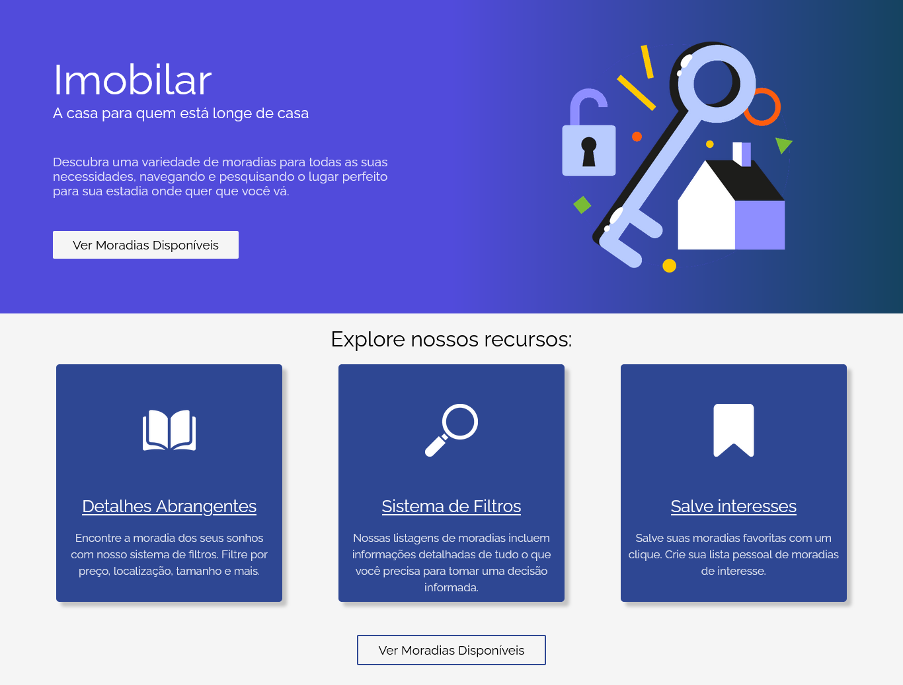
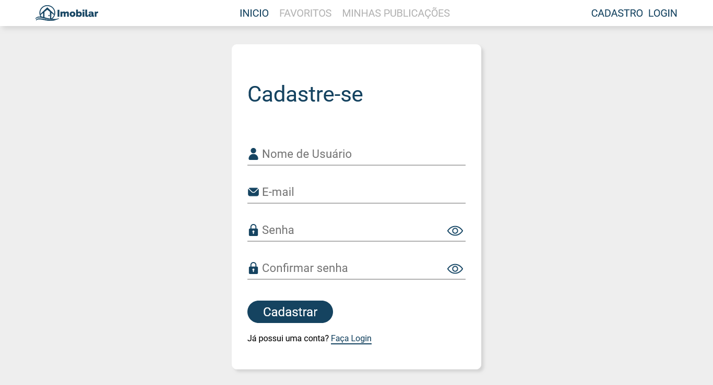
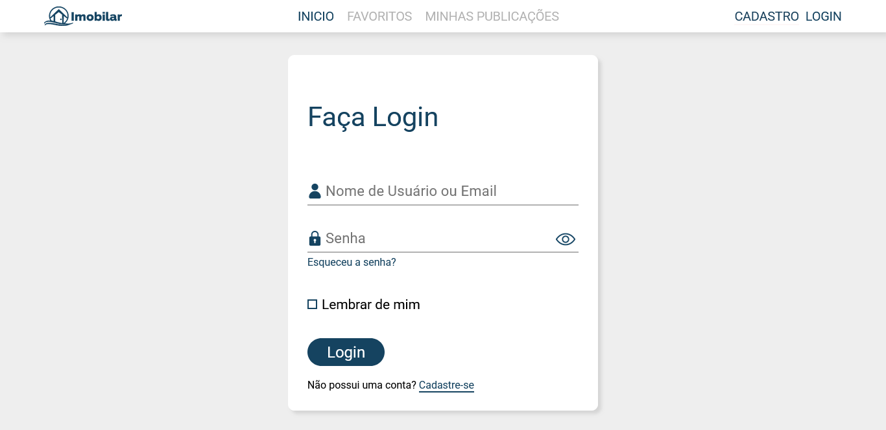
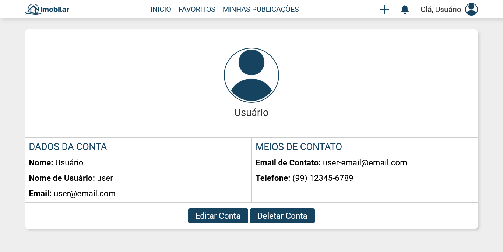
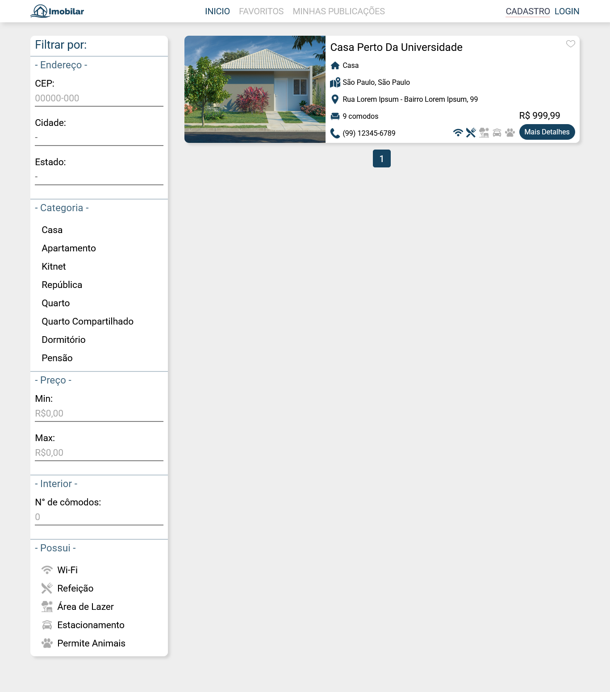
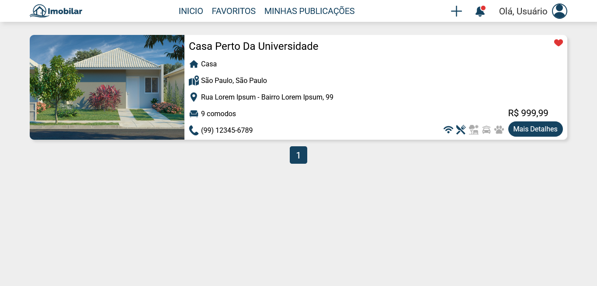
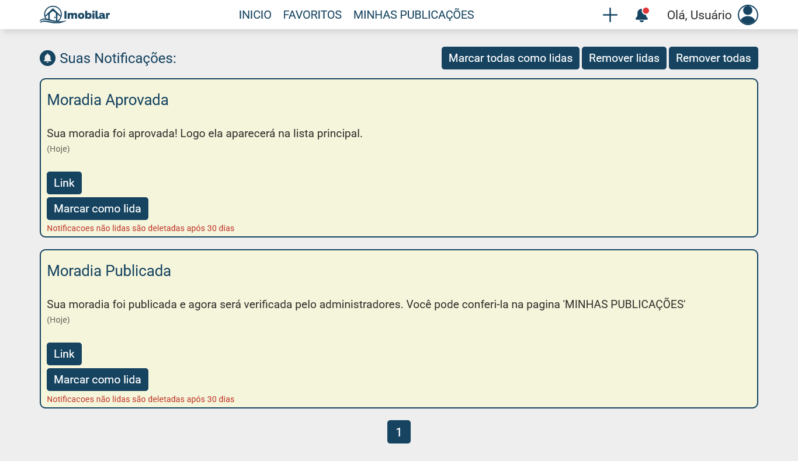
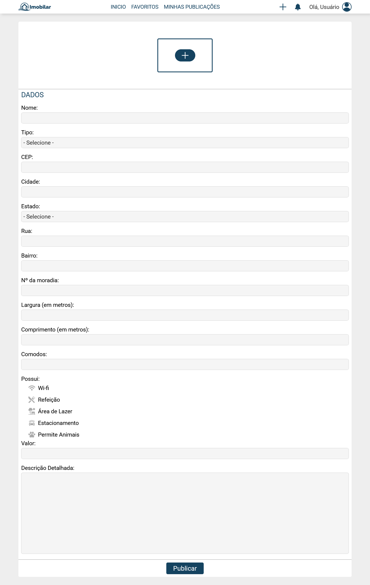
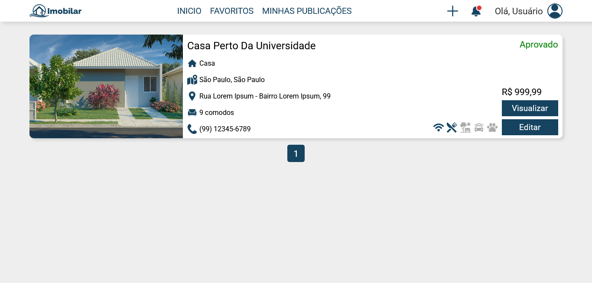
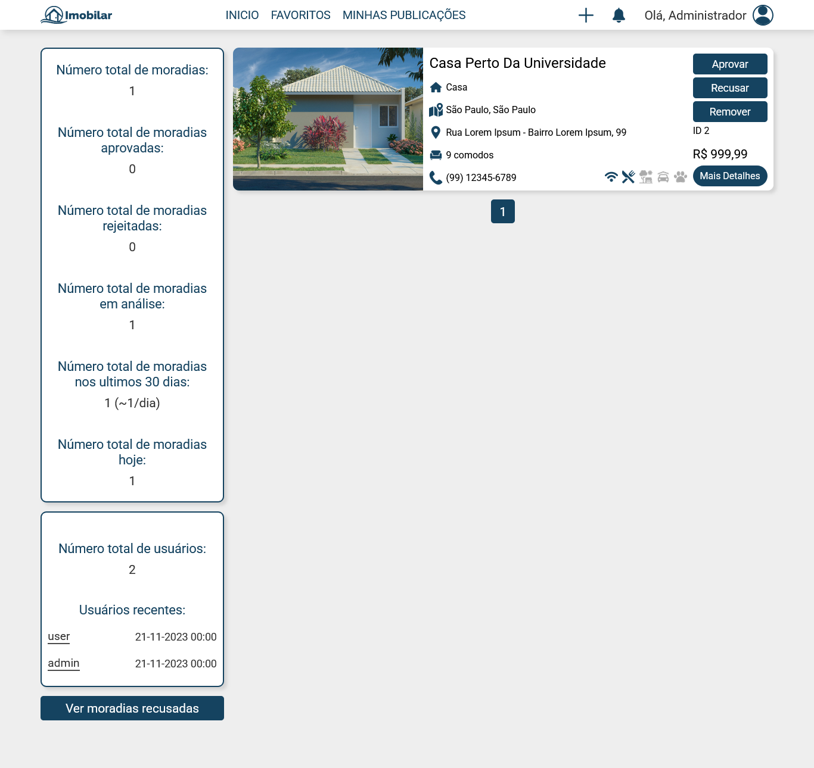

# 

## Sobre o projeto
Este projeto foi desenvolvido em 2023 como Trabalho de Conclusão de Curso (TCC) do Ensino Médio Técnico em Informática para a escola "Centro de Educação Profissional Tancredo Neves" em Brazópolis, Minas Gerais.
Ele consiste em um website que facilita a busca de moradias estudantis próximas a instituições de ensino.

## Descrição geral
O sistema foi desenvolvido para auxiliar estudantes na busca de moradias próximas a instituições de ensino, oferecendo uma plataforma simples para cadastro, login e consulta de imóveis. O foco principal do desenvolvimento foi o back-end em PHP, responsável por toda parte lógica e interação com o banco de dados.

Em relação a estrutura, o projeto segue o padrão MVC, separando os componentes em Model, View e Controller para melhorar a organização e manutenção. O sistema também utiliza roteamento de URL para direcionar cada requisição ao controlador adequado.

## Funcionalidades principais
O sistema oferece as seguintes funcionalidades principais:
- **Cadastro e Login de usuários**: criação de conta, autenticação e gerenciamento de acessos.
- **Verificação de e-mail via código**: envio automatizado de código de confirmação para validar novas contas.
- **Lista de moradias**: exibição de imóveis cadastrados com informações essenciais para consulta.
- **Área de administração**: gerenciamento de usuários, publicações e dados gerais do sistema.
- **Perfil do usuário**: visualização e edição de informações pessoais.
- **Salvar publicações**: possibilidade de favoritar moradias para consulta posterior.
- **Sistema de notificações**: alertas e mensagens relacionados às ações do usuário.

## Como rodar o projeto localmente
1. Clone o repositório.
2. Coloque a pasta do projeto em htdocs.
3. No banco de dados, crie o banco "imobilar".
4. Importe o arquivo imobilar.sql.
5. Acessar no navegador.
6. Para criar contas, configure um e-mail para envio de código (explicado a seguir).
7. O sistema inclui dois logins para facilitar o teste do projeto:

Usuário Comum:
```
username: user
password: user
email: user-email@email.com
```
Administrador:
```
username: admin
password: admin
email: admin-email@email.com
```

## Configuração de E-mail
Para configurar o e-mail:
1. Abra o arquivo `app\core\config.php`.
2. Localize a seção "SMTP Config" e preencha os valores de acordo com sua conta de e-mail:
```
define("SMTPHOST","");
define("SMTPUSERNAME","");
define("SMTPPASSWORD","");
define("SMTPCONNECTION","ssl");
define("SMTPPORT",465);
```
3. Após configurar, o sistema estará apto a enviar o código de verificação para novos usuários.

## Capturas de Tela
Abaixo estão algumas capturas de tela que demonstram o funcionamento do sistema, tanto para usuários comuns quanto para administradores.

### Página Inicial


---

### Cadastro 


### Login


---

### Perfil do Usuário


---

### Lista de Moradias


### Detalhes da Moradia


---

### Favoritos


---

### Notificações


---

### Publicar Nova Moradia


### Minhas Publicações


---

### Painel do Administrador


---

## Autores
**Gabriel Nunes Rego**  
Responsável pelo desenvolvimento completo do sistema, incluindo arquitetura, implementação de funcionalidades, banco de dados e lógica back-end/front-end.

**Lucas Lopis Fonseca**  
Responsável pela documentação do projeto original (TCC), incluindo plano de negócios, especificação técnica e descrição funcional.


